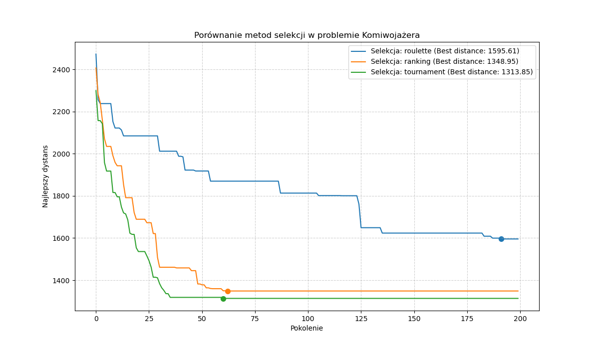
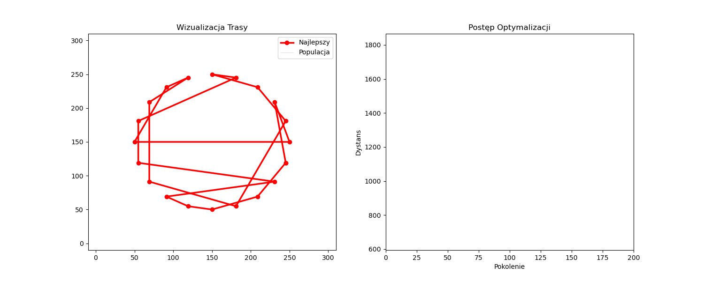
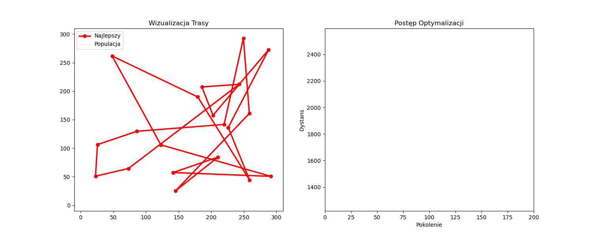

# Algorytm Genetyczny w Problemie Komiwojażera (TSP)
Projekt realizuje rozwiązanie **Problemu Komiwojażera (Traveling Salesman Problem)** przy użyciu lagorytmu ewolucyjnego. Celem jest znalezienie najkrótszej ścieżki łączącej zadany zbiór miast, odwiedzając każde z nich dokładnie raz i wracając do punktu startowego.

## Funkcje projektu
- **Modularna architektura**: Wydzielone operatory genetyczne (selekcja, krzyżowanie, mutacja).
- **Trzy metody selekcji**: Porównanie wydajności selekcji turniejowej, rankingowej oraz ruletkowej.
- **Dynamiczna wizualizacja**: Animacja procesu optymalizacji w czasie rzeczywistym przy użyciu `FuncAnimation`.
- **Analiza statystyczna**: Automatyczne śledzenie najlepszego wyniku (`best_distance`) oraz generacji, w której go osiągnięto.

## Uruchamianie projektu
Aby poprawnie uruchomić projekt i uniknąć błędów z importami, wykonaj poniższe kroki:

### 1. Przygotowanie środowiska
```bash
# Instalacja zależności
pip install -r requirements.txt

# Uruchomienie notatnika z programem
python /nootebooks/tsp_genetic_algorithm.ipynb
```

## Rezultaty i Wizualizacje
### Statystyczne porównanie metod selekcji
Poniższy wykres przedstawia zbieżność algorytmu dla trzech różnych metod wyboru rodziców. Widać wyraźnie różnice w szybkości osiągania minimum przez metodę turniejową względem ruletki.


### Animacja procesu optymalizacji
Algorytm w czasie rzeczywistym przebudowuje trasę, eliminując skrzyżowania i dążąc do najkrótszego cyklu Hamiltona. Czerwona linia reprezentuje aktualnie najlepszego osobnika w populacji.



## Wnioski z przeprowadzonych badań
Analiza działania algorytmu dla różnych scenariuszy pozwoliła na sformułowanie następujących spostrzeżeń:

### 1. Ranking Metod Selekcji
Na podstawie wykresów zbieżności ustalono hierarchię efektywności metod wyboru rodziców:
* **Selekcja Turniejowa (Tournament)**: Wykazuje najwyższą stabilność. Dzięki mechanizmowi walki kilku osobników o prawo do reprodukcji, najszybciej eliminuje najsłabsze geny, nie tracąc przy tym różnorodności zbyt wcześnie.
* **Selekcja Rankingowa (Ranking)**: Bardzo dobrze radzi sobie z unikaniem "przedwczesnej zbieżności". Skalowanie prawdopodobieństwa według pozycji w rankingu sprawia, że nawet wybitnie dopasowane jednostki nie dominują populacji natychmiastowo.
* **Selekcja Ruletkowa (Roulette)**: Najbardziej podatna na losowość. Przy dużej dysproporcji w dopasowaniu (fitness) może prowadzić do stagnacji algorytmu w optimach lokalnych.

### 2. Rola Operatorów Genetycznych
* **Krzyżowanie OX (Order Crossover)**: Jest kluczowe dla problemu TSP. W przeciwieństwie do standardowych metod krzyżowania, OX bezbłędnie zachowuje strukturę permutacji, co widać w animacji poprzez płynne "prostowanie się" trasy bez błędów w połączeniach miast.
* **Mutacja Swap**: Pełni rolę "bezpiecznika". W późnych fazach (powyżej 100. generacji), gdy populacja staje się homogeniczna, to właśnie mutacje pozwalają na odkrycie nowych, krótszych krawędzi, które wcześniej były pomijane.

### 3. Zjawisko Zbieżności (Convergence)
* **Test Okręgu**: Algorytm udowodnił swoją poprawność, każdorazowo znajdując trasę o kształcie wielokąta foremnego (najkrótsza możliwa ścieżka dla tego układu). Brak skrzyżowań linii w końcowej fazie animacji świadczy o osiągnięciu optimum globalnego.
* **Punkt Stabilizacji**: Dla populacji 100 osobników i 20 miast, algorytm zazwyczaj przestaje poprawiać wynik między **80. a 120. pokoleniem**. Dalsze iteracje rzadko przynoszą znaczące usprawnienia, co sugeruje optymalny koszt obliczeniowy na tym poziomie.

### 4. Znaczenie Elitaryzmu
Zastosowanie sukcesji elitarnej (kopiowanie najlepszego osobnika do nowej populacji) wyeliminowało problem "pogarszania się" wyników w kolejnych krokach. Gwarantuje to, że wykres dystansu jest funkcją monotonicznie malejącą lub stałą, co przyspiesza proces optymalizacji o ok. 20-30% w porównaniu do wersji bez elitaryzmu.

## Technologie i Biblioteki
Projekt został zrealizowany w języku **Python 3.13** z wykorzystaniem następujących bibliotek:

* **NumPy**: Zaawansowane operacje macierzowe i obliczenia dystansu euklidesowego.
* **Matplotlib**: Generowanie statycznych wykresów porównawczych oraz dynamicznych animacji (`FuncAnimation`).
* **IPython**: Renderowanie interaktywnych animacji w formacie HTML/JavaScript wewnątrz notatników.
* **Pillow**: Obsługa zapisu plików graficznych w wysokiej rozdzielczości.

## Struktura projektu
```text
TSP-genetic-algorithm/
├── src/                    # Główna logika algorytmu
│   ├── logic.py            # Główna pętla algorytmu genetycznego
│   ├── visualizer.py       # Funkcje do generowania animacji
│   ├── selection.py        # Implementacja metod selekcji
│   ├── operators.py        # Krzyżowanie OX i mutacja Swap
│   ├── objective_function.py # Obliczanie dystansu (fitness)
│   ├── cities.py           # Generowanie rozmieszczenia miast
│   └── config.py           # Parametry globalne algorytmu
├── notebooks/              # Analiza interaktywna
│   └── tsp_genetic_algorithm.ipynb
├── experiments/            # Skrypty do testów porównawczych
│   └── selection_method_experiment.py
├── results/plots/          # Zapisane wizualizacje wyników
├── data/                   # Ewentualne dane wejściowe
├── .gitignore              # Pliki ignorowane przez Git
├── README.md               # Dokumentacja projektu
└── requirements.txt        # Zależności biblioteczne
```
